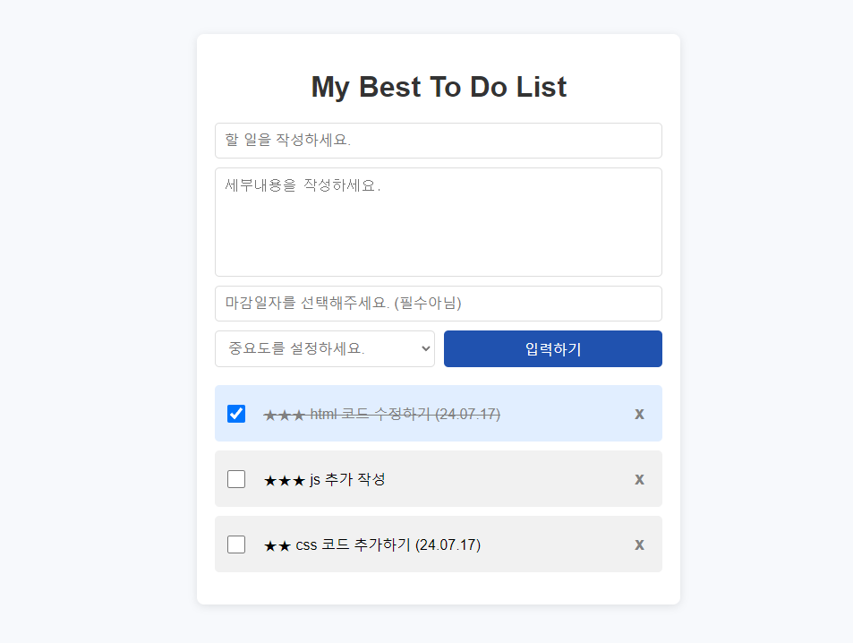

# Personal-project : Todolist

## 프로젝트 정의

 


**My Best To Do List**는 사용자의 할일 목록을 만들어 할일을 명확하게 정의하여 할일을 잊지않게 계획하고 효과적으로 모두 완료할 수 있도록 도와주는 것을 목적으로 합니다. 이 프로젝트는 웹 브라우저에서 실행되는 간단한 웹 페이지입니다.

- 할 일의 목록 및 세부내용을 작성, 삭제 할 수 있습니다.
- 할 일 목록의 상태를 확인 및 설정 ( 진행중, 완료 )할 수 있습니다.
- My Best To Do List는 할 일을 수정하거나 우선순위를 제공합니다.

## 프로젝트 구조

Todo/  
├── index.html  
├── styles/  
│ └── style.css  
├── scripts/  
│ └── main.js  
└── images/  
├── README.md  
└── document/  
├── 기능정의서.md  
├── 요구사항정의서.md  
└── 프로젝트설계서.md  

## 설치

My Best To Do List는 서버와 클라이언트 시스템으로 구성되며 Html,Css,Javascript 기반으로 작업하였습니다. 
이 프로젝트는 별도의 설치 과정이 필요 없습니다. 다만, 로컬에서 실행하기 위해 필요한 파일들을 다운로드 받아야 합니다.

### 1. 프로젝트 클론하기
터미널(명령 프롬프트)에서 아래 명령어를 사용하여 GitHub 저장소를 클론합니다.

``` bash git clone <https://github.com/Haley513/Todo.git>  ```

### 2. 프로젝트 디렉토리로 이동하기

``` cd Todo ```

프로젝트를 확인하기 위해서는 Git이 설치되어 있어야 합니다. 다음 링크를 통해 사용자 환경에 맞는 버전을 설치해주세요.

[Git - Downloads](https://git-scm.com/downloads)

## 실행

프로젝트를 실행하기 위해 특별한 서버나 설정이 필요하지 않습니다. 단순히 index.html 파일을 웹 브라우저로 열면 됩니다.

프로젝트 디렉토리에서 index.html 파일을 더블 클릭하거나, 다음 명령어를 사용하여 브라우저에서 엽니다.

 open index.html # macOS  
 start index.html # Windows  
 xdg-open index.html # Linux 

또는 브라우저를 열고 파일 메뉴에서 index.html 파일을 선택하여 엽니다.

## 배포 (예정)

이 프로젝트는 GitHub Pages를 사용하여 배포되었습니다.(예정)
웹 브라우저를 열고 다음 URL로 이동하여 배포된 웹사이트를 확인합니다.

[https://Haley513.github.io/Todo](https://Haley513.github.io/Todo)


## 문서

프로젝트 설계 문서는 document 디렉토리에 마크다운 파일로 기록되어있습니다.
각각의 설계 문서는 다음과 같습니다.

- [요구사항정의서](document/요구사항정의서.md)
   - 제품이 제공해야하는 기능요구 정의서입니다.
   - 요구사항 정의서에 기술된 기능은 최소 기능 요구사항이며 추상적일 수 있습니다.
   - 기능의 구체화는 제품 구현 단계에서 이루어집니다.
- [프로젝트설계서](document/프로젝트설계서.md)
   - 요구사항 정의서를 기반으로 프로젝트를 설계합니다.
- [기능정의서](document/기능정의서.md)
   - 사용자 스토리를 기반으로 세부 기능을 정의합니다.  


## 라이선스

이 README 파일은 기본적인 HTML, CSS, JavaScript 프로젝트에 대한 설치, 실행, 배포 방법을 설명합니다. 이 프로젝트는 MIT 라이선스를 따르며 필요에 따라 내용을 추가하거나 수정할 수 있습니다.